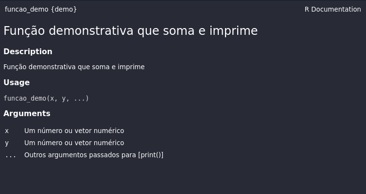

# Dados

## Sobre dados

Lorem ipsum

## Funções e dependências

Até este momento, foi abordada apenas uma forma de organizar os arquivos de uma
análise: projetos. Entretanto existe ainda outra maneira, ainda mais
interessante, de guardar análises. Se você programou em R, com certeza já se
deparou com essa ferramenta, os bons e velhos pacotes ou bibliotecas. É
surpreendentemente fácil criar um diretório que pode ser completamente acessado
através da função `library()`.

Quando uma tarefa de análise de dados aumenta em complexidade, o número de
funções e arquivos necessários para manter tudo em ordem cresce
exponencialmente. Um arquivo para ler os dados, outro para limpar os nomes das
colunas, mais um para fazer joins... Cada um deles com incontáveis blocos de
código que rapidamente se transformam em uma
[macarronada](https://pt.wikipedia.org/wiki/C%C3%B3digo_espaguete).

O primeiro passo para sair dessa situação é transformar tudo em funções. Essa
tarefa está longe de simples, mas os benefícios são imensos; ao encontrar um
erro no resultado, fica bem mais fácil depurar a função culpada do que uma
coleção desordenada de código. Funções têm argumentos e saídas, enquanto código
solto pode modificar globais e criar resultados tardios que são impossíveis de
acompanhar sem conhecer profundamente a tarefa sendo realizada.

```r
library(dplyr)
library(tibble)

# Limpar dados
mtcars_clean <- mtcars %>%
  rownames_to_column(var = "model") %>%
  as_tibble() %>%
  filter(cyl < 8)

# Selecionar carros com 4 cyl e tirar média de mpg e wt
mtcars_clean %>%
  filter(cyl == 4) %>%
  group_by(cyl) %>%
  summarise(
    mpg = mean(mpg),
    wt = mean(wt)
  )
#> # A tibble: 1 x 3
#>     cyl   mpg    wt
#>   <dbl> <dbl> <dbl>
#> 1     4  26.7  2.29

# Selecionar carros com 6 cyl e tirar média de drat e disp
mtcars_clean %>%
  filter(cyl == 6) %>%
  group_by(cyl) %>%
  summarise(
    drat = mean(drat),
    disp = mean(disp)
  )
#> # A tibble: 1 x 3
#>     cyl  drat  disp
#>   <dbl> <dbl> <dbl>
#> 1     6  3.59  183.
```

O código acima é somente um exemplo de análise. Como descrito pelos comentários,
`mtcars` é limpa e depois são extraídas as médias de diferentes variáveis para
duas seleções da tabela (número de cilindros igual a 4 e 6). Abaixo está
descrita uma forma de transformar a maioria deste código em funções. É verdade
que pela natureza simples do exemplo, fica difícil ver os benefícios do
encapsulamento das tarefas de limpeza e resumo, mas perceba, por exemplo, que,
se fosse necessário trocar `mean()` por `median()`, antes seria necessário
alterar quatro linhas e agora apenas uma. Esse tipo de ganho a longo prazo pode
salvar análises inteiras do caos.

```r
library(dplyr)
library(tibble)

# Limpa tabela, filtrando cyl < cyl_max
clean <- function(data, cyl_max = 8) {
  data %>%
  rownames_to_column(var = "model") %>%
  as_tibble() %>%
  filter(cyl < cyl_max)
}

# Resume tabela onde cyl == cyl_max, tirando média das colunas em ...
summarise_cyl <- function(data, cyl_num, ...) {
  data %>%
  filter(cyl == cyl_num) %>%
  group_by(cyl) %>%
  summarise_at(vars(...), mean)
}

# 4 cyl, média de mpg e wt
mtcars %>%
  clean(cyl_max = 8) %>%
  summarise_cyl(cyl_num = 4, mpg, wt)
#> # A tibble: 1 x 3
#>     cyl   mpg    wt
#>   <dbl> <dbl> <dbl>
#> 1     4  26.7  2.29

# 6 cyl, média de drat e disp
mtcars %>%
  clean(cyl_max = 8) %>%
  summarise_cyl(cyl_num = 6, drat, disp)
#> # A tibble: 1 x 3
#>     cyl  drat  disp
#>   <dbl> <dbl> <dbl>
#> 1     6  3.59  183.
```

Um código bem encapsulado reduz a necessidade de objetos intermediários (
`base_tratada`, `base_filtrada`, etc.) pois para gerar um deles basta a
aplicação de uma função. Além disso, programas com funções normalmente são muito
mais enxutos e limpos do que *scripts* soltos, pois estes estimulam repetição de
código. Às vezes é mais rápido copiar e colar um pedaço de código e adaptá-lo ao
novo contexto do que criar uma função que generalize a operação desejada para as
duas situações, mas os benefícios das funções são de longo prazo: ao encontrar
um *bug*, haverá apenas um lugar para concertar; se surgir a necessidade de
modificar uma propriedade, haverá apenas um lugar para editar; se aquele código
se tornar obsoleto, haverá apenas um lugar para deletar.

Pense na programação funcional[^1] como ir à academia. No início o processo é
difícil e exige uma quantidade considerável de esforço, mas depois de um tempo
se torna um hábito e traz benefícios consideráveis para a saúde (neste caso, do
código). As recomendações para quando criar uma nova função ou separar uma
função em duas variam muito, mas normalmente é uma boa ideia não deixar uma
única função ser encarregada de mais uma tarefa ou ficar longa/complexa demais.

[^1]: Aqui o termo "programação funcional" é usado de forma figurativa. Na
computação linguagens denominadas "funcionais" tem um *modus operandi* bastante
específico não abordado neste capítulo.

No mundo ideal, na pasta `R/` do seu projeto haverá uma coleção de arquivos,
cada um com uma coleção de funções relacionadas e bem documentadas, e apenas
alguns arquivos que utilizam essas funções para realizar a análise em si. Como
dito anteriormente, isso fica muito mais fácil se você já tiver esse objetivo em
mente desde o momento de criação do novo projeto.

### ::

No exemplo da seção anterior, é possível notar as chamadas para as bibliotecas
`dplyr` e `tibble`. Elas têm inúmeras funções úteis, mas aqui somente algumas
poucas foram utilizadas. Além disso, se o código fosse muito maior, ficaria
impossível saber de uma biblioteca ainda está sendo utilizada; se não fosse mais
necessário utilizar `rownames_to_column()`, qual seria a melhor forma de saber
que pode ser removida a chamada `library(tibble)`?

A resposta para essa pergunta pode assustar: no código ideal, a função
`library()` nunca seria chamada, todas as funções teriam seus pacotes de origem
explicitamente referenciados pelo operador `::`.

Esta subseção está separada porque ela de fato é um pouco radical demais. É
excessivamente preciosista pedir para que qualquer análise em R seja feita sem
a invocação de nenhuma biblioteca, apenas com chamadas do tipo
`biblioteca::funcao()`. Muitas pessoas inclusive nem sabem que é possível
invocar uma função diretamente através dessa sintaxe!

Se algum leitor estiver tendendo a seguir o caminho do TOC da programação,
existem dois grandes benefícios em chamar todas as funções diretamente:
- O código, no total, executa um pouco mais rápido porque são carregadas menos
funções no ambiente global (isso é especialmente importante em aplicações
interativas feitas em Shiny).
- As dependências do código estão sempre atualizadas porque elas estão
diretamente atreladas às próprias funções sendo utilizadas.

Existe um terceiro e importante benefício, mas este será abordado apenas no
próximo capítulo. A título de curiosidade, o código anterior ficaria assim caso
fosse escrito sem as chamadas para `library()`:

```r
# Referência ao pipe
`%>%` <- magrittr::`%>%`

# Limpa tabela, filtrando cyl < cyl_max
clean <- function(data, cyl_max = 8) {
  data %>%
    tibble::rownames_to_column(var = "model") %>%
    dplyr::as_tibble() %>%
    dplyr::filter(cyl < cyl_max)
}

# Resume tabela onde cyl == cyl_max, tirando média das colunas em ...
summarise_cyl <- function(data, cyl_num, ...) {
  data %>%
    dplyr::filter(cyl == cyl_num) %>%
    dplyr::group_by(cyl) %>%
    dplyr::summarise_at(dplyr::vars(...), mean)
}

# 4 cyl, média de mpg e wt
mtcars %>%
  clean(cyl_max = 8) %>%
  summarise_cyl(cyl_num = 4, mpg, wt)
#> # A tibble: 1 x 3
#>     cyl   mpg    wt
#>   <dbl> <dbl> <dbl>
#> 1     4  26.7  2.29

# 6 cyl, média de drat e disp
mtcars %>%
  clean(cyl_max = 8) %>%
  summarise_cyl(cyl_num = 6, drat, disp)
#> # A tibble: 1 x 3
#>     cyl  drat  disp
#>   <dbl> <dbl> <dbl>
#> 1     6  3.59  183.
```

Se serve de consolo, o RStudio facilita muito esse tipo de programação por causa
da sua capacidade de sugerir continuações para código interativamente. Para
escrever `dplyr::`, por exemplo, basta digitar `d`, `p`, `l` e apertar `TAB` uma
vez. Com os `::`, as sugestões passarão a ser somente de funções daquele pacote.

## Pacotes

Nas palavras do maior guru do R, Hadley Wickham, "pacotes são a unidade
fundamental de código R reprodutível". Toda vez que você utiliza a função
`library()`, algum pacote está sendo carregado na sessão. Muitas vezes criar uma
biblioteca de funções pode parecer uma tarefa árdua e confusa, restrita a
grandes conhecedores da linguagem, mas essa impressão não poderia estar mais
distante da realidade: pacotes para o R são bastante simples e intuitivos de
fazer.

No início deste livro foi abordado o conceito de projeto. Ele não passa de um
arquivo `.Rproj` que indica para o RStudio que aquele diretório é um ambiente de
trabalho estruturado. Nesse sentido, pacotes iguais a projetos porque eles
também têm um `.Rproj`; pacotes na verdade *são* projetos.

A diferença entre os dois é que pacotes podem ser documentados e instalados,
permitindo toda uma gama de novas possibilidades para o programador.
Muitas vezes uma análise de dados pode envolver dezenas de funções e diversas
pessoas, fazendo com que o compartilhamento de código seja vital para que a
análise não fuja do controle. Pacotes permitem gerenciar dependências, manter
documentação, executar testes unitários e muito mais com o objetivo de deixar
todos os analistas na mesma página.

Sendo assim, recomenda-se criar um pacote para qualquer análise que envolva pelo
menos meia dúzia de funções complexas e mais de uma pessoa; caso contrário, um
projeto já é suficiente. Outra motivação para criar um pacote é compartilhar
conjuntos úteis de funções com outras pessoas; isso acaba sendo menos comum para
a maioria dos usuários, mas é importante ressaltar que o R não seria a linguagem
popular que é hoje se não fossem pelas famosas bibliotecas `ggplot2` e `dplyr`.

```r
usethis::create_package("~/Documents/demo")
#> ✔ Setting active project to '~/Documents/demo'
#> ✔ Creating 'R/'
#> ✔ Writing 'DESCRIPTION'
#> Package: demo
#> Title: What the Package Does (One Line, Title Case)
#> Version: 0.0.0.9000
#> Authors@R (parsed):
#>     * First Last <first.last@example.com> [aut, cre] (<https://orcid.org/YOUR-ORCID-ID>)
#> Description: What the package does (one paragraph).
#> License: What license it uses
#> Encoding: UTF-8
#> LazyData: true
#> ✔ Writing 'NAMESPACE'
#> ✔ Writing 'demo.Rproj'
#> ✔ Adding '.Rproj.user' to '.gitignore'
#> ✔ Adding '^demo\\.Rproj$', '^\\.Rproj\\.user$' to '.Rbuildignore'
#> ✔ Opening '~/Documents/demo/' in new RStudio session
#> ✔ Setting active project to 'demo'
```

A função executada acima é exatamente análoga à função de criação de projetos.
A principal diferença é que ela cria um arquivo `DESCRIPTION` e assume que o
nome do pacote é igual ao nome da pasta onde o mesmo está sendo criado (neste
caso, "demo"). Alguns outros arquivos também são criados (como `.Rbuildignore` e
`NAMESPACE`), mas eles não vêm ao caso. De resto, o pacote é idêntico a um
projeto e pode ser sincronizado com o Git exatamente da mesma maneira.

O primeiro passo para começar a usar um pacote é atribuir a ele uma licença
(caso um dia você resolva compartilhá-lo com o mundo) e preencher a descrição.
Abaixo encontra-se uma função simples que adiciona uma licença MIT ao pacote.

```r
usethis::use_mit_license("Seu Nome")
#> ✔ Setting active project to '~/Documents/demo'
#> ✔ Setting License field in DESCRIPTION to 'MIT + file LICENSE'
#> ✔ Writing 'LICENSE.md'
#> ✔ Adding '^LICENSE\\.md$' to '.Rbuildignore'
#> ✔ Writing 'LICENSE'
```

O arquivo de descrição, no entanto, é um pouco mais complexo porque ele tem
alguns campos que precisam ser preenchidos manualmente. Quando o pacote for
criado, eles já estarão populados com instruções para facilitar a vida do
programador. Abaixo está um exemplo de como `DESCRIPTION` deve ficar depois de
completo:

```
Package: demo
Title: O Que o Pacote Faz (Uma Linha)
Version: 0.0.0.9000
Authors@R: 
    person(given = "Seu",
           family = "Nome",
           role = c("aut", "cre"),
           email = "seunome@dominio.com")
Description: O que o pacote faz (um paragrafo curto terminado em ponto final).
License: MIT + file LICENSE
Encoding: UTF-8
LazyData: true
```

A partir deste ponto, os metadados do pacote estão essencialmente prontos e não
precisam mais ser modificados. Assim como em um projeto, o que resta é adicionar
arquivos com funções à pasta `R/`.

### Documentação

Para poder programar pacotes com mais facilidade, é necessário instalar o
`devtools`. Assim como o `tidyverse`, este é um conjunto de pacotes (que inclui
o `usethis` por sinal) que auxiliam no processo de criar e testar um pacote de
R.

```r
install.packages("devtools")
```

A partir de agora você pode, por exemplo, criar documentações para as funções do
seu pacote. Quando outras pessoas o instalarem, elas poderão consultar esses
manuais da mesma forma que fazem com qualquer outra função: `?funcao()`.

A documentação mais simples (e obrigatória) envolve dar um título para a função
e descrever o que cada parâmetro significa. Para documentar uma função qualquer,
basta adicionar comentários em cima dela com `#'` assim como no exemplo abaixo:

```r
#' Função demonstrativa que soma e imprime
#'
#' @param x Um número ou vetor numérico
#' @param y Um número ou vetor numérico
#' @param ... Outros argumentos passados para [print()]
#'
#' @export
funcao_demo <- function(x, y, ...) {
  z <- x + y
  print(z, ...)
  return(z)
}
```

No RStudio esse tipo de documentação é tratado diferentemente de outros
comentários, então certas palavras-chave ficam coloridas. `@param` por exemplo
indica a documentação de um dos parâmetros e `@export` indica que aquela função
será exportada pelo pacote, ou seja, ficará disponível ao usuário quando ele
executar `library(demo)`.

Para gerar a documentação do pacote, basta chamar uma outra função do
`devtools`:

```r
devtools::document()
#> Updating demo documentation
#> Updating roxygen version in ~/Documents/demo/DESCRIPTION
#> Writing NAMESPACE
#> Loading demo
#> Writing NAMESPACE
#> Writing funcao_demo.Rd

?funcao_demo()
#> Rendering development documentation for 'funcao_demo'
```

```{r, echo=FALSE, fig.align='center', dpi=50}

```

Conforme o número de funções no pacote for crescendo, basta iterar nesse ciclo
descrito até aqui. Além disso, é importante lembrar (como destacado na sessão
anterior) que qualquer função utilizada de outro pacote deve ser invocada na
forma `pacote::funcao()`; neste momento, o pacote em questão se tornará uma
*dependência* do seu pacote e deve ser declarado como tal com
`usethis::use_package("pacote")`.

Para garantir que o R não encontrará nenhum problema no seu pacote, basta
executar a função de verificação `devtools::check()`. Se nenhum defeito for
encontrado, basta compartilhar o pacote com os seus colegas e instalá-lo com
`devtools::install_local()`.

```r
devtools::check()
#> Updating demo documentation
#> Writing NAMESPACE
#> Loading demo
#> Writing NAMESPACE
#> ── Building ───────────────────────────────────────────────────────── demo ──
#> Setting env vars:
#> ● CFLAGS    : -Wall -pedantic -fdiagnostics-color=always
#> ● CXXFLAGS  : -Wall -pedantic -fdiagnostics-color=always
#> ● CXX11FLAGS: -Wall -pedantic -fdiagnostics-color=always
#> ─────────────────────────────────────────────────────────────────────────────
#> ✔  checking for file ‘/home/clente/Documents/demo/DESCRIPTION’ ...
#> 
#> [... omitido por brevidade ...]
#> 
#> ── R CMD check results ───────────────────────────────── demo 0.0.0.9000 ────
#> Duration: 8.2s
#> 
#> 0 errors ✔ | 0 warnings ✔ | 0 notes ✔
```

### Testes automatizados

Antes de concluir a sessão sobre pacotes, se faz necessária uma breve menção aos
testes automatizados. Eles são disponibilizados pelo pacote `testthat` e
permitem que um programador verifique que seu código está atendendo às
especificações. Testes unitários garantem que uma alteração pontual em algum
ponto do código não vai alterar o comportamento de nenhuma outra parte, já que
as outras funções ainda terão que passar nos seus próprios testes.

Para criar um conjunto de testes é necessário primeiro criar o ambiente para tal
dentro do pacote. Depois disso, basta criar conjuntos individuais de testes para
cada função.

```r
usethis::use_testthat()
#> ✔ Adding 'testthat' to Suggests field in DESCRIPTION
#> ✔ Creating 'tests/testthat/'
#> ✔ Writing 'tests/testthat.R'
#> ● Call `use_test()` to initialize a basic test file and open it for editing.

usethis::use_test("funcao_demo")
#> ✔ Increasing 'testthat' version to '>= 2.1.0' in DESCRIPTION
#> ✔ Writing 'tests/testthat/test-funcao_demo.R'
#> ● Modify 'tests/testthat/test-funcao_demo.R'
```

Como é possível notar, o pacote `testthat` permite criar um arquivo de testes
para `funcao_demo()` (neste caso `tests/testthat/test-funcao_demo.R`). Esse
arquivo já vem com um teste padrão a título de demonstração, mas, depois de
reescrito manualmente, um possível conjunto de testes para `funcao_demo()` seria
o seguinte:

```
library(demo)

test_that("funcao_demo funciona", {

  expect_equal(funcao_demo(1, 2), 3)
  expect_equal(funcao_demo(-1, -2), -3)
  expect_equal(funcao_demo(1, -2), -1)

  expect_output(funcao_demo(1, 2), "3")

})
```

E o resultado da execução dos testes é o seguinte:

```r
devtools::test()
#> Loading demo
#> Testing demo
#> ✔ |  OK F W S | Context
#> ✔ |   4       | funcao_demo
#> 
#> ══ Results ═════════════════════════════════════════════════════════════════════
#> OK:       4
#> Failed:   0
#> Warnings: 0
#> Skipped:  0
#> 
#> Keep up the good work.
```

## Data e data-raw

Na seção anterior, foi discutida a importância de empacotar uma análise. Seja
para organizar dependências, reutilizar código, manter testes automatizados, ou
qualquer outra razão, pacotes são a melhor forma de guardar e compartilhar
código em R. Mas, apesar de toda a conversa sobre programação, pouco foi
abordado sobre outro elemento essencial de uma análise de dados: dados.

Felizmente, pacotes em R têm lugares específicos para guardar dados brutos e
dados tratados. São as pastas `data` e `data-raw`, cada uma com as suas
propriedades e possibilidades. Ambas podem ser criadas com facilidades por
funções do pacote `usethis`, então elas se encaixam perfeitamente no fluxo de
análise descrito até agora.

Como indicado anteriormente, existem dois tipos de dados: brutos e tratados.
Normalmente dados brutos estão em formatos comumente compartilhados em ambientes
de trabalho: planilhas Excel, arquivos CSV, etc. Os pacotes `readxl` e `readr`
permitem que esses formatos sejam importados para dentro do R, mas normalmente
essas funções são mais lentas e menos padronizadas do que `readRDS()`, por
exemplo, que lê arquivos no formato nativo do R.

Além disso, raramente os dados recebidos durante uma análise estarão
perfeitamente organizados e padronizados. É comum precisar de múltiplos fluxos
de tratamento para poder transformar os dados brutos naquilo que de fato pode
ser utilizado durante uma análise.

O programador é encorajado a separar essas planilhas brutas daquelas resultantes
do processo de limpeza e tratamento. Junto com os dados crús, é importante
também guardar os arquivos que fazem o processo de limpeza; caso haja uma
mudança nas demandas ou nas bases, o analista precisa ser capaz de alterar os
*scripts* de tratamento e gerar novas bases consolidadas.

No exemplo abaixo, supõe-se um diretório com um pacote R e uma base bruta
denominada `dados.xlsx`. Primeiramente deve-se executar a função
`usethis::use_data_raw()` para criar a pasta `data-raw` e um arquivo de
tratamento para a base em questão.

```r
usethis::use_data_raw("dados")
#> ✔ Setting active project to '~/Documents/demo'
#> ✔ Creating 'data-raw/'
#> ✔ Adding '^data-raw$' to '.Rbuildignore'
#> ✔ Writing 'data-raw/dados.R'
#> ● Modify 'data-raw/dados.R'
#> ● Finish the data preparation script in 'data-raw/dados.R'
#> ● Use `usethis::use_data()` to add prepared data to package
```

Como indicado pelos três últimos pontos da saída do comando, agora basta colocar
o código de tratamento da base `dados` em `data-raw/dados.R` e por fim utilizar
`usethis::use_data()` para adicionar os dados preparados ao pacote. Para
prosseguir o exemplo, o arquivo `dados.xlsx` foi copiado para o diretório
`data-raw` e o código abaixo foi inserido em `data-raw/dados.R`.

```r
library(magrittr)

# Limpar a base dados.xlsx
dados <- "data-raw/dados.xlsx" %>%
  readxl::read_xlsx() %>%
  dplyr::filter(cyl > 4) %>%
  dplyr::mutate(
    brand = stringr::str_extract(model, "^[A-z]+")
  ) %>%
  dplyr::group_by(brand) %>%
  dplyr::summarise(
    mean_mpg = mean(mpg),
    prop_6_cyl = sum(cyl == 6)/dplyr::n()
  ) %>%
  dplyr::arrange(brand)

# Salvar a base para uso no pacote
usethis::use_data(dados)
#> ✔ Creating 'data/'
#> ✔ Saving 'dados' to 'data/dados.rda'
```

Neste caso o arquivo Excel foi criado de dentro do prṕrio R com o comando
`writexl::write_xlsx(tibble::rownames_to_column(mtcars, "model"), "data-raw/dados.xlsx")`,
mas isso é só um exemplo ilustrativo. O importante é saber o que acontece quando
a função `use_data()` é executada para um objeto do ambiente global, ou seja,
as duas últimas linhas do bloco de código acima.

Por trás das câmeras, `use_data()` está chamando a função `save()` do R para
gerar um arquivo RDA a partir de um objeto do ambiente global. Arquivos RDA são
extremamente estáveis, compactos e podem ser carregados rapidamente pelo R,
tornando este formato o principal meio de guardar dados de um pacote. Se os
dados do pacote forem guardados assim, eles ficarão disponíveis para serem
chamados pelo usuário (você mesmo durante a análise)! Para entender como ficam
os dados uma vez que eles são incluídos na pasta `data`, basta dar uma olhada
no objeto `dplyr::starwars`; neste caso, a base tratada e exportada se chama
`starwars`.

Para carregar os dados na sua sessão e poder utilizá-los na análise, basta
executar `pkgload::load_all()` ou pressionar a combinação `CTRL + SHIFT + L` no
RStudio. Independentemente do número de tabelas que estiverem salvas na pasta
`data`, todas serão carregadas instantaneamente.

A título de curiosidade, existem algumas situações em que as bases brutas são
grandes demais para serem sincronizadas com o GitHub. A plataforma tem um
(razoável) limite de 1GB por repositório que pode ser insuficiente para
armazenar dados brutos e tratados. Para não sincronizar as bases brutas com o
Git, basta adicioná-las ao arquivo `.gitignore` do pacote; no caso do exemplo
acima, bastaria adicionar a esse arquivo uma linha com o texto
`data-raw/dados.xlsx`.

### Documentação

Além de funções, também é possível documentar bases de dados com o pacote
`roxygen2`. Para isso, crie um arquivo `data.R` na pasta `R/` do pacote e crie
um objeto entre aspas com o nome de cada base de dados exportada. Documentar
dados é extremamente útil quando o pacote vai ser compartilhado com múltiplas
pessoas da mesma organização, pois assim não é necessário compartilhar uma
planilha Excel separada descrevendo cada uma das colunas da tabela.

Uma boa documentação de bases de dados não precisa de muita coisa. Abaixo é
exemplificado como seria documentada `dados`:

```r
#' Dados sobre 15 marcas de carros
#'
#' A tabela, gerada a partir de `mtcars`, apresenta algumas poucas
#' informações sobre carros com mais de 4 cilindros de 15 marcas
#' americanas de carros.
#'
#' @format Uma tabela com 3 colunas e 15 linhas:
#' \describe{
#'   \item{brand}{Marca}
#'   \item{mean_mpg}{Milhas por galão médias para aquela marca}
#'   \item{prop_6_cyl}{Proporção dos carros que apresentam 6 cilindros}
#' }
#' @source Henderson and Velleman (1981)
"dados"
```
