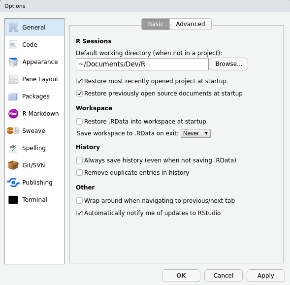
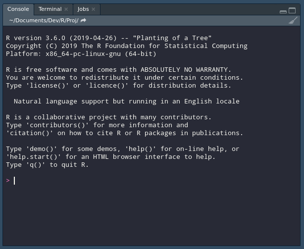

# Rproj e diretórios {#rproj-dir}

Um programador iniciante corre o risco de não gerenciar seus projetos. Muitas
vezes seus arquivos de código ficarão espalhados pelos infinitos diretórios de
seu computador, esperando a primeira oportunidade de sumir para sempre. No R
isso não é diferente: organizar arquivos é uma parte integral do processo de
programação.

Felizmente o RStudio possui uma ferramenta incrível que auxilia na tarefa de
consolidar todos os recursos necessários para uma análise. Denominados
"projetos", eles não passam de pastas comuns com um arquivo `.Rproj`.

O primeiro passo para organizar um bom ambiente de trabalho para análises de
dados é criar um diretório onde todos os seus programas R podem viver. No meu
computador eu tenho a pasta `~/Documents/Dev/R/`, mas não importa onde ela
está, apenas que seja um lugar o qual você lembre sem dificuldades. Tendo
criado um esse *workspace*, é importante registrá-lo como o seu ambiente de
trabalho no RStudio: basta selecioná-lo em
**Tools > Global Options... > Browse**.

```{r}

```

Desta forma, toda vez que você iniciar um novo projeto no R, ele por parão
usará essa nova pasta como ambiente padrão! Se você já tiver alguns arquivos
espalhados pelo seu computador, traga eles para o seu diretório de programas.

O segundo passo no processo de organização dos seus projetos é um pouco mais
complexo e demanda mais atenção. Não basta juntar todos os arquivos em um só
lugar, é importante colocá-los em subdiretórios para que a sua pasta
não vire um equivalente virtual a uma mesa desorganizada. Assim como em uma
mesa cada papel e cada utensílio tem uma gaveta, cada arquivo precisa fazer
parte de um projeto.

É nesse ponto que os "projetos" do RStudio dialogam com os projetos da vida
real. Em uma empresa, cada cliente é um projeto; na academia, cada pesquisa é
um projeto; e assim por diante. Cada projeto seu deve ter a sua própria pasta
para que seja fácil encontrar todos os códigos e dados pertencentes a um único
assunto. Mas esta não deve ser uma pasta comum, ela deve ser um projeto.

O código listado abaixo demonstra como criar um projeto no RStudio. Basta
apenas um comando e ele já fará tudo que for necessário para preparar o seu
ambiente de desenvolvimento.

```r
usethis::create_project("~/Documents/Dev/R/Proj/")
#> ✔ Creating '~/Documents/Dev/R/Proj/'
#> ✔ Setting active project to '~/Documents/Dev/R/Proj'
#> ✔ Creating 'R/'
#> ✔ Writing 'Proj.Rproj'
#> ✔ Adding '.Rproj.user' to '.gitignore'
#> ✔ Opening '~/Documents/Dev/R/Proj/' in new RStudio session
#> ✔ Setting active project to 'Proj'
```

Cada linha da saída do comando representa algo que ele fez para preparar o
projeto. A mais importante é a quarta linha, que cria o arquivo `Proj.Rproj`;
ele indica para o RStudio que aquele diretório será a raiz de um projeto e que,
portanto, várias outras funcionalidades podem ser ativadas. Por exemplo,
clicando duas vezes neste arquivo já carrega o RStudio com os arquivos de
`Proj`.

Importante também é a pasta `R/` criada. Nela você deve colocar todos os seus
arquivos de código referentes àquele projeto com nomes que descrevam bem o que
cada um faz. Se você seguiu o conselho anterior e juntou todos os seus códigos
no seu diretório de trabalho, crie um projeto novo para cada grupo de programas
que vocẽ tiver detectado. Talvez um para exercícios de R, um para cada cliente,
um para uma nova ideia, etc. Cada um deles deve ter um nome descritivo e
conter, em sua pasta R, todos os arquivos necessários para aquela análise.

## Diretório de trabalho

Mas a funcionalidade mais importante dentre todas as já citadas é o conceito do
*working directory* ou diretório de trabalho. No canto esquerdo superior do
Console do RStudio existe um caminho denominado diretório de trabalho, que é
essencialmente a raiz do seu projeto. Muitos programadores que aprenderam R há
muito tempo conhecem uma função chamada `setwd()`; se você nunca ouviu falar
disso, não se preocupe e continue assim, mas se você costuma usá-la, siga
prestando atenção.

```{r}

```

O R dá a possibilidade de mudar, instantaneamente, o diretório de trabalho.
Isso que dizer que os caminhos relativos para arquivos podem mudar em questão
de linhas. O exemplo abaixo demonstra superficialmente como isso funciona:

```r
# Abrindo dois arquivos em diretórios diferentes

setwd("~/Downloads")
a <- read.csv("a.csv")

setwd("~/Documents/Dev/R/Proj")
b <- read.csv("b.csv")

write.csv(a, "c.csv")
```

Isso não parece tão problemático à primeira vista, mas usar `setwd()` cria um
vício difícil de abandonar. Essa função estimula que os seus projetos continuem
desorganizados com arquivos espalhados pelo computador, mas também confunde o
programador na hora de salvar arquivos. Onde será salvo o arquivo `c.csv`?
De onde veio o arquivo `a.csv` ou de onde veio o `b.csv`? E se essa linha fosse
mudada de lugar para antes do segundo `setwd()`? São perguntas difíceis de
responder caso você não esteja atento ao código todo.

A solução que os projetos oferecem para isso é fazer com que o diretório de
trabalho seja sempre a pasta do projeto. Neste caso é como se, ao abrir o
RStudio, ele executasse o comando `setwd("~/Documents/Dev/R/Proj")`
automaticamente. Mas como ler então o arquivo `a.csv`?

```r
# Duas formas de ler a.csv

a <- read.csv("~/Downloads/a.csv")

file.copy("~/Downloads/a.csv", "a.csv")
a <- read.csv("a.csv")
```

A primeira forma deixa explícito que aquele arquivo não faz parte do projeto e
que portanto deve ser tratado como temporário. A segunda forma, mais indicada,
é trazer o arquivo para dentro do projeto! Se ele é importante, é essencial que
ele esteja junto com todos os outros dados de Proj. Com o código acima, o
comando `write.csv(a, "c.csv")` salvaria `c.csv` dentro do projeto sem sombra
de dúvidas.

Os principais benefícios de não usar `setwd()` são dois: saber sempre onde os
arquivos utilizados estão/serão salvos e poder compartilhar um projeto com
qualquer pessoa. `setwd()` depende que seja explicitado um caminho dentro do
seu computador e isso nem sempre é verdade no computador de outra pessoa;
fazendo com que todos os arquivos estejam no projeto e com caminhos relativos
nos códigos permite que outro usuário replique a sua análise sem ter que
modificar nem uma linha do programa.
