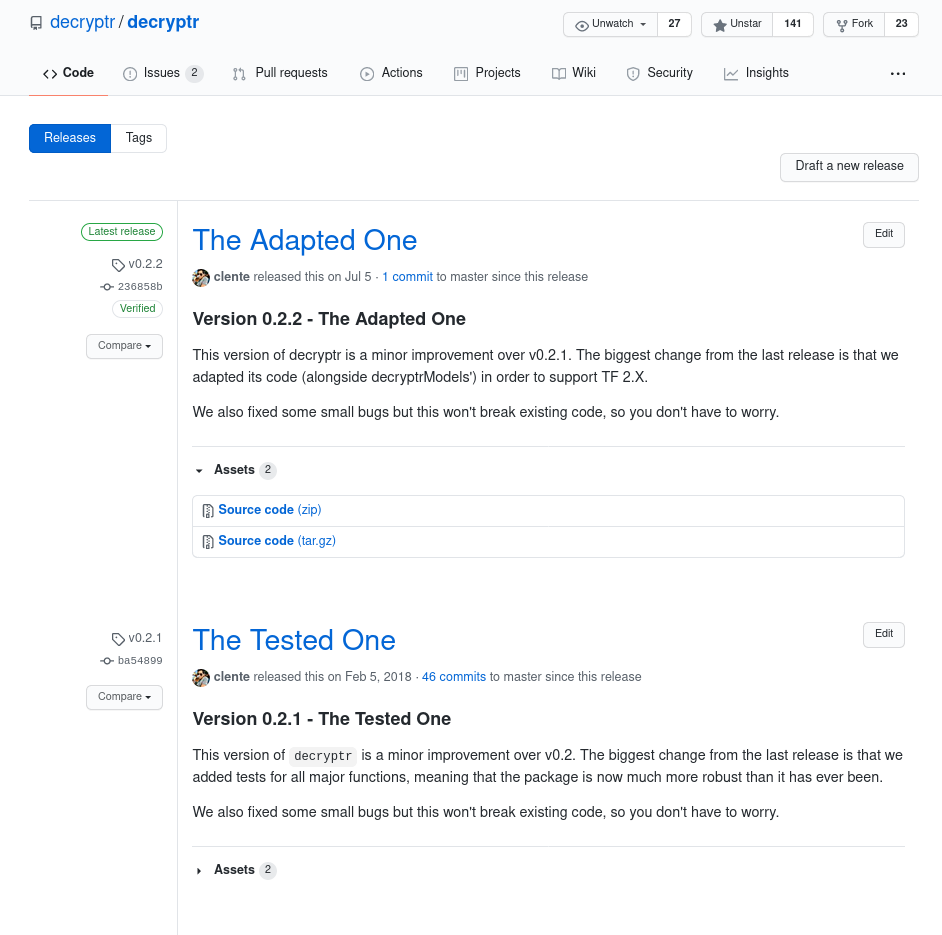
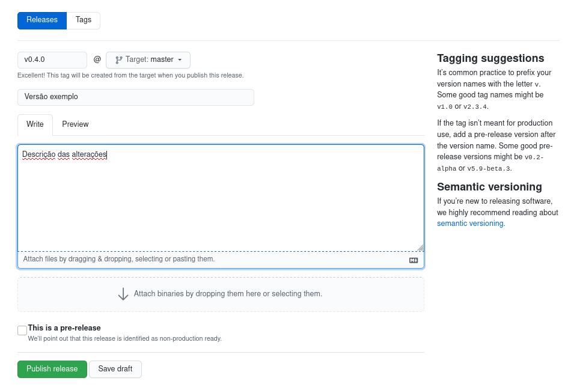

# Versões e releases {#versoes-releases}

A maior parte dos softwares que utilizamos no dia-a-dia possuem versões, até
mesmo aqueles que não costumamos associar com esse tipo de prática. Sistemas
operacionais, como Windows 10 e iOS 13 , têm as versões embutidas em seus
próprios nomes, enquanto muitos aplicativos, como WhatsApp 2.20.22, só exibem
esse tipo de informação no fundo da página de configurações.

Pacotes do R também possuem versões. Ao executar o comando `update.packages()`
(inclusive faça isso agora caso você nunca o tenha feito), o R é forçado a
procurar por versões mais recentes dos pacotes instalados na sua máquina. É
importante deixar claro que "versão" não é nada mais que o identificador de uma
atualização do software; se eu mudar uma linha do código do meu pacote e
atualizar esse fonte no GitHub, pode-se dizer que criei uma nova versão do meu
pacote.

Mas por que marcar e dar nomes a essas atualizações? É bastante mais fácil
simplesmente continuar programando e exigir que seus usuários baixem a versão
mais recente do seu código. Essa prática, entretanto, é ruim para o usuário e
para o programador.

Você, como programador, quer poder fazer alterações no seu código que não
necessariamente estão prontas para o público em geral. Erros acontecem e, muitas
vezes, é preciso fazer uma série de modificações antes que o pacote volte a ter
certa estabilidade. Por outro lado, o usuário também só quer atualizar seu
pacote quando algo suficientemente diferente estiver disponível (sejam correções
de erros, sejam novas funcionalidades). Além disso, caso uma nova versão do seu
código gere problemas para ele, é necessário ter uma versão estável anterior
claramente rotulada para que o usuário possa fazer o *downgrade* do pacote.

E justamente são esses rótulos que precisamos utilizar para ter um bom sistema
de versões nos nossos pacotes. Ao contrário de "controle de versão", para o qual
utilizamos o Git, "versionamento semântico" é a prática de dar nomes fáceis de
entender para as versões de um projeto. Trazendo isso para termos concretos, o
pacote `dplyr` está na versão 0.8.4, o `ggplot2` está na 3.2.1 e o `shiny`
está na 1.4.0.

## Versionamento semântico

Em teoria, existe um [padrão ouro](https://semver.org/) para a nomenclatura de
versões de um software. Alguns dos seus preceitos, como o uso de 3 números
inteiros não-negativos separados por pontos, são extremamente valiosos, enquanto
outros nem sempre são seguidos ao pé da letra. Aqui tratamos do protocolo
padronizado, mas apenas você pode determinar quanto dele o seu esquema de
nomenclatura seguirá.

Uma versão é denotada pela forma X.Y.Z, onde:
- X é a versão maior (denominada *major*);
- Y é a versão menor (denominada *minor*) e
- Z é a versão do conserto (denominada *patch*).

Um patch não passa de uma versão atualizada na qual apenas bugs foram
corrigidos; nenhuma funcionalidade pode ser alterada e qualquer código escrito
utilizando a versão sem o patch deve continuar funcionando. Quando alguma nova
funcionalidade é introduzida ao programa, mas ele continua sendo
retrocompatível (ou seja, compatível com as suas versões anteriores), deve ser
incrementada a versão minor. Por fim, se for introduzida alguma mudança que
quebra a retrocompatibilidade, deve ser incrementada a versão major. É
importante dizer também que, depois de lançada, uma versão **nunca** deverá ser
alterada, pois isso confundirá os usuários da mesma.

Alguns pontos do versionamento semântico não são seguidos sempre, mas podem ser
úteis. Por exemplo, o patch pode ser omitido se ele for 0, a major 0 normalmente
é reservada para software em fase de testes (o `dplyr`, portanto, não segue essa
regra) e às vezes sufixos em texto podem ser adicionados (como "-alpha",
"-beta", etc.).

Para propósitos ilustrativos, imaginemos um pacote chamado `pacotr` que possui
apenas uma função com protótipo `f(x, y, z = TRUE)`. Um caminho imaginário para
seu desenvolvimento pode ser o seguinte:
- Versão 0.1.0: a primeira versão com código do pacote contém uma função
`f(x, y)`;
- Versão 0.1.1: um bug é consertado em `f(x, y)`;
- Versão 0.1.2: mais um bug é consertado em `f(x, y)`;
- Versão 1.0.0: o pacote sai do beta quando a função ganha um novo argumento
`z`, agora necessário para o seu funcionamento, e vira `f(x, y, z)`;
- Versão 1.0.1: um bug é consertado em `f(x, y, z)`;
- Versão 1.2.0: o argumento `z` agora tem um valor padrão, transformando a
função em `f(x, y, z = FALSE)`;
- Versão 2.0.0: o argumento `z` muda seu valor padrão, quebrando qualquer código
escrito utilizando a versão 1.x.x, se tornando `f(x, y, z = TRUE)`

Utilizando o exemplo acima sem perda de generalidade, entre qualquer dois passos
subsequentes haveriam versões denominadas de desenvolvimento, como por exemplo
0.1.1.9000, 1.0.0.9000 e assim por diante. Isso não está no padrão ouro do
versionamento semântico, mas é comumente utilizado em programas de R.

Uma versão de desenvolvimento é qualquer "subversão" que não deveria ser
utilizada pelo usuário final; qualquer commit entre patches, minors ou majors é
uma versão de desenvolvimento. Por convenção, a primeira versão de
desenvolvimento é marcada como 9000, podendo chegar até 9999. Alguns
programadores incrementam esse número a cada commit realizado, mas é mais comum
manter o 9000 até que o código esteja pronto para se tornar um verdadeiro patch,
minor ou major.

Na prática, é muito simples trabalhar com versões. Assim que um novo pacote é
criado através de `usethis::create_package()`, o arquivo `DESCRIPTION` tem a
seguinte cara:

```
Package: demo
Title: What the Package Does (One Line, Title Case)
Version: 0.0.0.9000
Authors@R: 
    person(given = "First",
           family = "Last",
           role = c("aut", "cre"),
           email = "first.last@example.com",
           comment = c(ORCID = "YOUR-ORCID-ID"))
Description: What the package does (one paragraph).
License: What license it uses
Encoding: UTF-8
LazyData: true
```

Note como o campo *Version* já está populado com a primeira versão possível para
um pacote: 0.0.0.9000. Depois de alguns commits, se acharmos que o código está
preparado para a primeira minor, utilizamos:

```r
usethis::use_version("minor")
#> ✔ Setting Version field in DESCRIPTION to '0.1.0'
```

A segunda linha já deixa claro que agora o arquivo `DESCRIPTION` contém uma
linha `Version: 0.1.0` (note como a versão de desenvolvimento é removida
automaticamente). **Mas atenção**, antes de fazer qualquer outra alteração no
pacote, você deve se certificar de que esta alteração receberá um commit só para
ela. Atualmente o `usethis` faz isso automaticamente.

O **primeiro** commit após a alteração da versão deve trazer o pacote de volta
para o estado de desenvolvimento. Ou seja, deve existir um único commit no qual
o pacote é considerado estável para cada sequência de commits de
desenvolvimento.

```r
usethis::use_dev_version()
#> ✔ Setting Version field in DESCRIPTION to '0.1.0.9000'
```

Depois que o pacote voltar para desenvolvimento, a programação pode continuar
desimpedida. Por completude, `usethis::use_version()` pode ser utilizada para
qualquer versão cheia:

```r
usethis::use_version("patch")
#> ✔ Setting Version field in DESCRIPTION to '0.1.1'

usethis::use_dev_version()
#> ✔ Setting Version field in DESCRIPTION to '0.1.1.9000'

usethis::use_version("major")
#> ✔ Setting Version field in DESCRIPTION to '1.0.0'
```

## Releases

Uma parte interessante do processo de versionamento é que o GitHub permite
marcar commits específicos como estáveis e atribuir um rótulo aos mesmos. No
fundo isso não passa de um versionamento semântico integrado ao site.

Como exemplo, podemos ver a aba "Releases" do pacote `decryptr`:

```{r}

```

É bom fazer esse tipo de versionamento externo porque os usuários passam a ter
um lugar de fácil acesso com o código-fonte de absolutamente todas as versões do
seu pacote. Além disso, a função `devtools::install_github()` é capaz de
utilizar esses releases como indicador de qual versão de um pacote deve ser
baixada.

Para criar releases de um pacote seu, antes você deve dar push no commit da
versão atual (depois de `usethis::use_version()` e antes de
`usethis::use_dev_version()`), pois assim estará pública no GitHub exatamente a
versão do seu pacote que deve ser baixada pelos usuários. Depois basta ir para
a aba das releases e clicar em **Draft a new release**. Preencha os campos
correspondentes e publique a versão.

```{r}

```

Uma forma eficiente de manter todas as alterações realizadas no pacote de forma
organizada é com um arquivo `NEWS`. Ele pode ser criado com
`usethis::use_news_md()` e criar um novo título para cada versão. Observe como
[esse arquivo](https://github.com/tidyverse/ggplot2/blob/master/NEWS.md) é
utilizado no `ggplot2`.
